# DLC Diagram Viewer User Guide
This User Guide describes how to use the DLC Diagram Viewer. 
It is structured along the steps all the user needs to create a new diagram from scratch.
So, if you follow the steps in the given order, it works like a tutorial. 
For the basic setup, just follow the steps A) to D).

## A) Register User

1. Create an Account

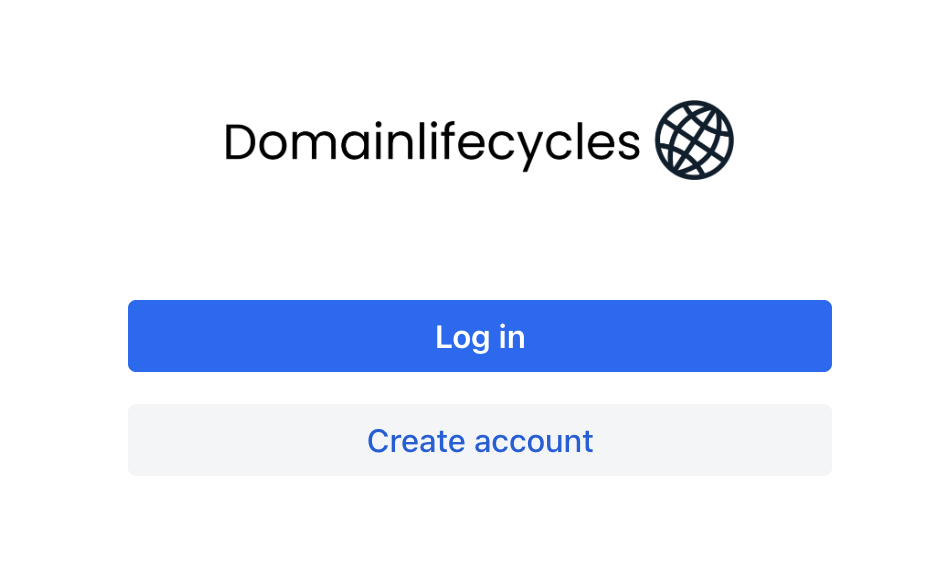
 - Click on ``Create Account``.

2. Fill in the form
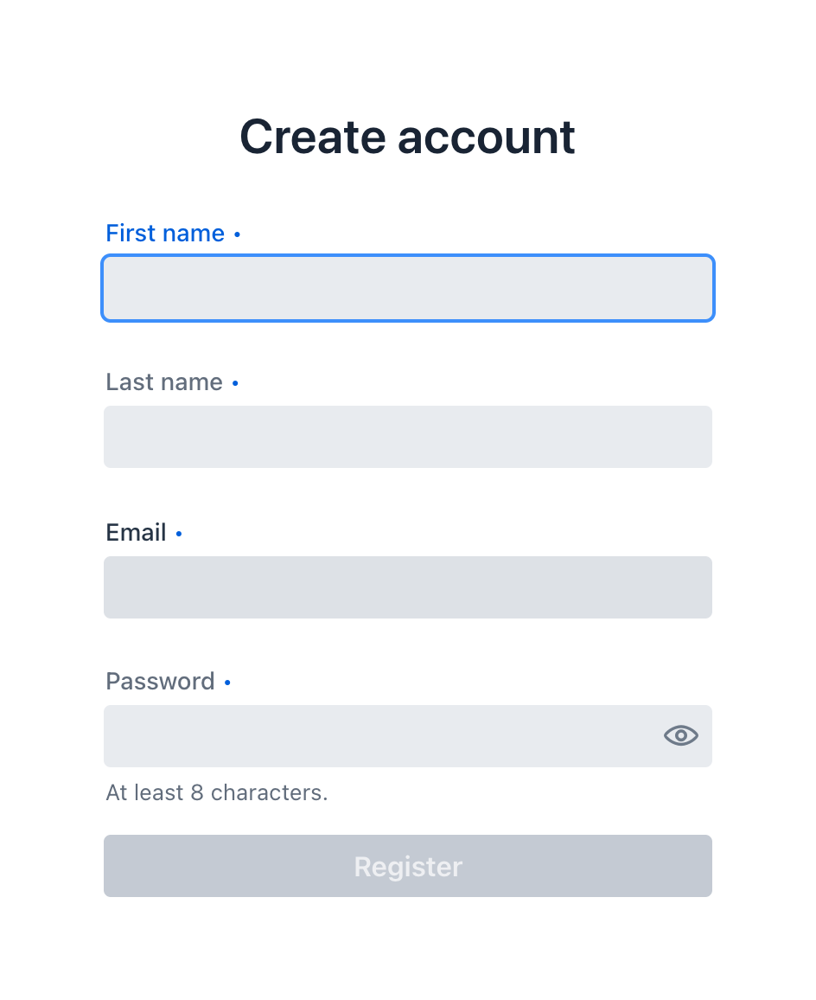
 - There is currently no email validation, so be sure there is no typo in your email adress 
 - There is currently no password reset, so be sure you do not forget your password

Click on ``Register``

## B) Login
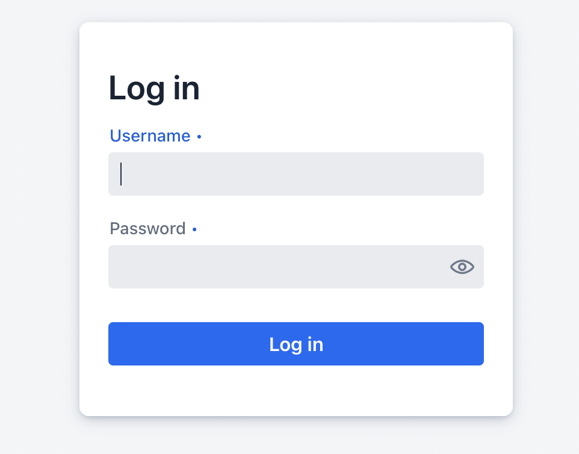
- Enter your email adress form registration as username and password
- Click on ``Log in``

## C) Upload Domain Model

1. Get your API Key
- After login, you can open the user menu (circle in upper right corner)
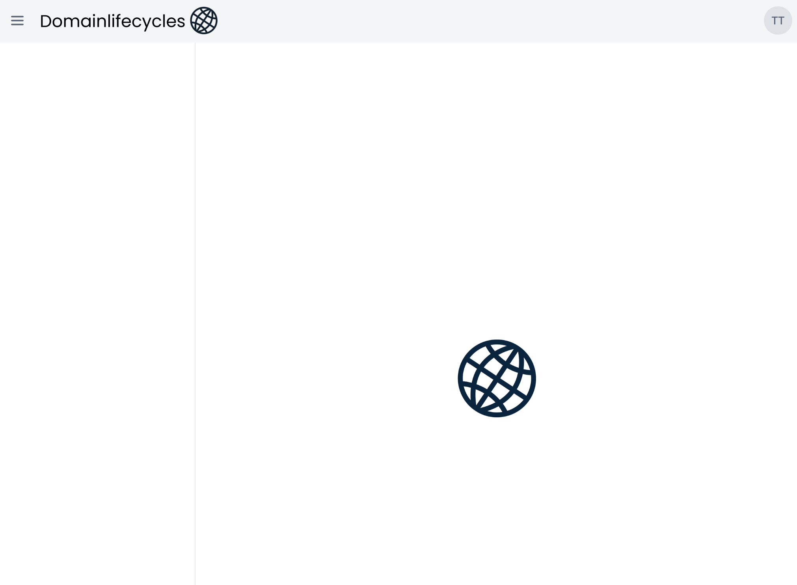
- Click on ``Copy API-Key``
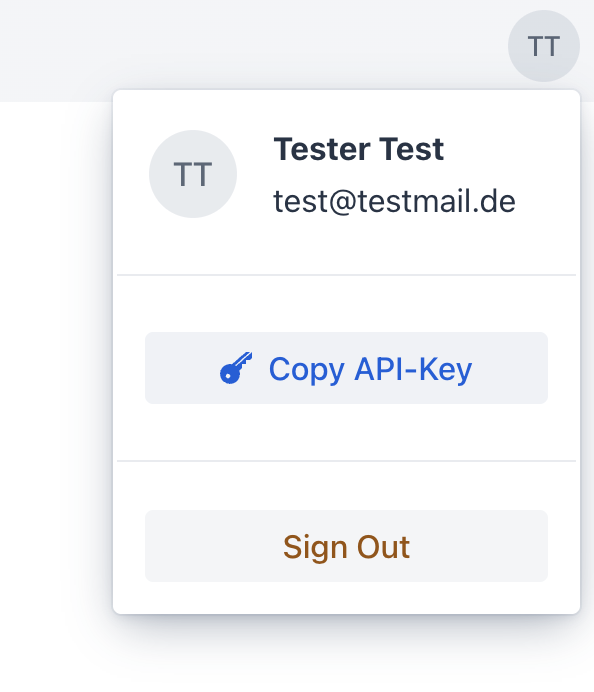
- Use the API Key with the build plugin as described below 

2. Upload your domain model via build plugin
- Use one of the [DLC Build Plugins](https://github.com/esentri/domainlifecycles/tree/main/dlc-plugins) 
to upload your domain model to the DLC Diagram Viewer. There you may also find a usage description for the Maven plugin.
- You can test the upload by checking out the [Demo Project](https://github.com/esentri/ddd-hotel-demo)

```Gradle
plugins {
	id 'io.domainlifecycles.dlc-gradle-plugin' version '3.4.0'
}
...
dlcGradlePlugin {
    domainModelUpload {
        domainModelPackages = ["com.esentri"]
        projectName = "ddd-reception-demo"
        apiKey = "xxxxxxxx-xxxx-xxxx-xxxx-xxxxxxxxxxxx"
        diagramViewerBaseUrl = "http://localhost:8090"
        // static analysis of the domain classes, uploaded alongside the domain model (default: true)
        runStaticAnalysis = true
        // packages considered by the static analysis (default: domainModelPackages)
        staticAnalysisPackages = ["com.esentri"]
        // max. number of classes cached while analyzing (default: 500)
        staticAnalysisCacheSize = 500
        // stream the upload instead of assembling it in memory first (default: false)
        streamUpload = true
    }
}
```
- Change the parameters to your needs
- Don't forget to have a DLC diagram Viewer running, when executing the plugin
- Insert the API key from the DLC Diagram Viewer into the build plugin parameters
- Run the upload with ``gradle domainModelUpload``

Uploading requires access to the project: the first upload of a project name creates the project
for the user owning the API key. Later uploads to the same project name update it, but only if the user
owning the API key is assigned to that project (as its creator, or via ``Share Project``). Otherwise the
upload is rejected.

#### Static analysis
Since plugin version 3.4.0, the upload by default also includes the result of a static (bytecode) analysis of your
compiled domain classes. It captures which methods call which other methods, and together with the domain events
and commands of the domain model, this enables the [flow filter](#filter-on-flows) of the Diagram Viewer.
Without it, the flow filter is not available and only shows a hint.

- ``runStaticAnalysis``: set to ``false`` to upload only the domain model and skip the analysis
  (e.g. to speed up the build, if flow filtering is not needed).
- ``staticAnalysisPackages``: the packages (including their subpackages) the analysis considers. By default, these are the
  ``domainModelPackages``, not the whole classpath, which would be considerably more expensive for large projects.
  Widen it, if concrete implementations of your repository or outbound service interfaces live in other packages
  (e.g. an infrastructure package), otherwise the flows through these implementations are not found.
- ``staticAnalysisCacheSize``: the analysis keeps memory usage bounded by caching only this many classes at a time
  (default ``500``). Lower it for very large projects to save memory (at the cost of re-parsing classes more often),
  raise it if you have memory to spare.

The analysis is run on the compiled classes, so the upload task compiles your project first.

#### Stream upload
The domain model and the static analysis result are uploaded as JSON, which can reach tens of megabytes for a domain
of a few hundred types. The upload is therefore always gzip-compressed, the Diagram Viewer decompresses it transparently.

- By default (``streamUpload = false``), the complete compressed request is assembled in memory before it is sent.
  This is simple and sufficient for small and medium-sized domains.
- With ``streamUpload = true``, the JSON is streamed directly into the HTTP request while it is being produced
  (using chunked transfer encoding), so the complete JSON is never held in memory. Use this for large domains, where
  the default could otherwise risk an ``OutOfMemoryError`` in your build.

Both variants use the same endpoint of the Diagram Viewer, so no configuration is needed on the viewer side.
The plugin applies a 10 second connect timeout and an overall 5 minute request timeout, so an unreachable or slow
Diagram Viewer fails the build instead of hanging it.

For the Maven plugin, the same options are available as ``<runStaticAnalysis>``, ``<staticAnalysisPackages>``,
``<staticAnalysisCacheSize>`` and ``<streamUpload>``, see the [DLC Build Plugins](https://github.com/esentri/domainlifecycles/tree/main/dlc-plugins) documentation.

3. After a successful upload, refresh the diagram viewer page and you can see the new project on the left side.
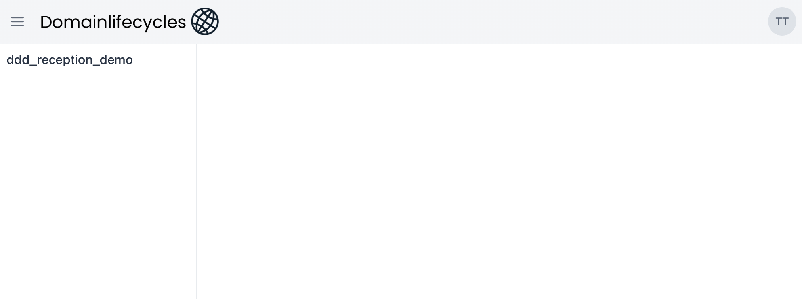

## D) Add New Diagram

1. Click on the project first
2. Then click ``Create new Diagram``
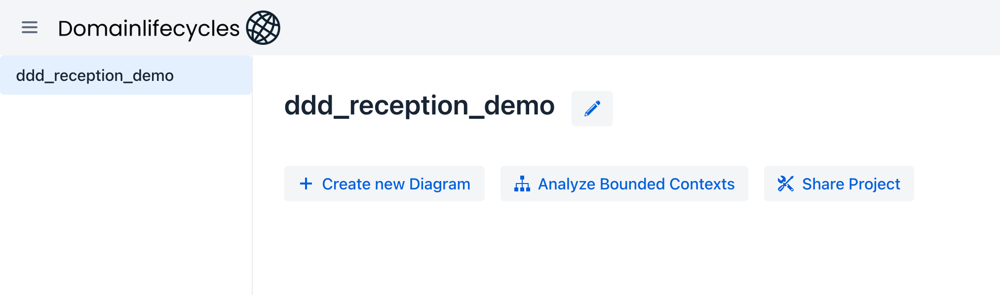
3. Fill in the Diagram Name and click ``Create``
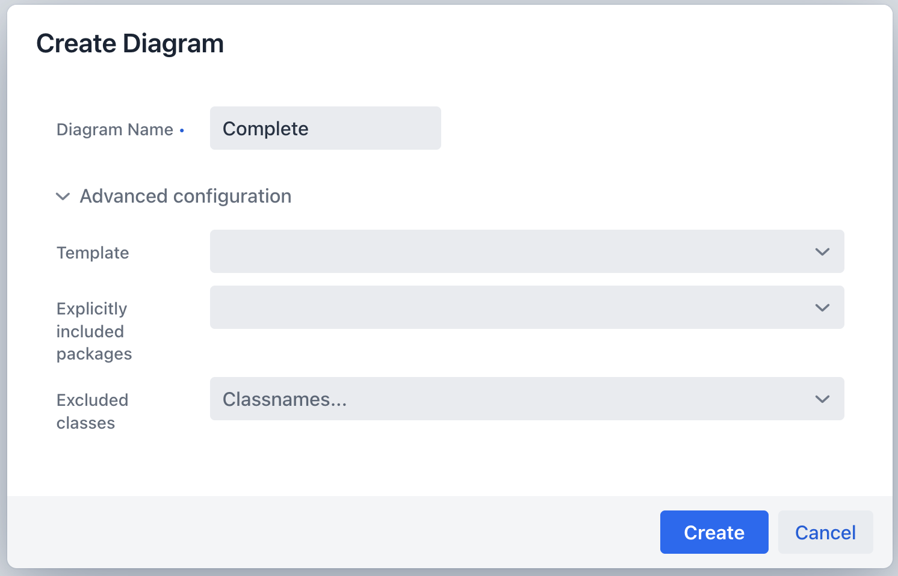
4. After creating the diagram, you can see the diagram name in the menu on the left side. If you click there, you can see the diagram.
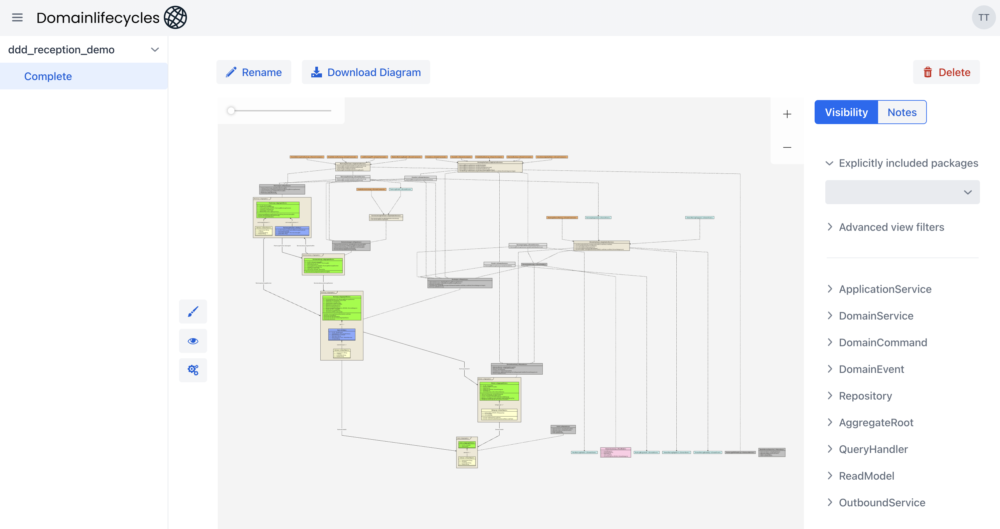

Diagram names have to be unique within their folder (or among the diagrams of the project without folder) - diagrams
in different folders may share a name. The diagram view shows the name of the diagram above it, below the path of its
folder.

### Analyze Bounded Contexts
To get started with a large model, the viewer can create a set of diagrams for you. In the project view, click
``Analyze Bounded Contexts``. A dialog explains what will be created; after confirming, the viewer creates a folder for
each Bounded Context of the project, named after the Bounded Context (or its package, if it has no name), containing

- a diagram ``Aggregates`` showing only the aggregates of the Bounded Context,
- a sub folder ``Read Models`` with a diagram per top level read model of the Bounded Context, named after the read
  model, showing everything leading into the read model (backward flow). A read model contained in another one (as
  field, ``Optional`` or collection) gets no diagram of its own: it is shown, connected by a composition, in the
  diagram of the read model containing it. Without read models, there is no such folder,
- a sub folder ``Commands`` with a diagram per command of the Bounded Context, named after the command, showing the
  flow the command triggers (forward flow) together with everything leading into the methods processing it (backward
  flow - a command itself has no backward flow, since nothing in the analysis models where a command is created).
  Without commands, there is no such folder.

If two read models or commands of a Bounded Context share their simple name, their diagram names are followed by
their package, relative to the Bounded Context, e.g. ``AktiviereCommand (core.domain.vertrag)``.

The read model and command diagrams need the static analysis result (see [Static analysis](#static-analysis)); without
it, only the aggregate diagrams are created. The diagrams are rendered in the background, a notification tells when all
of them are ready. Running the analysis again, e.g. after new commands were added, only adds what is missing: existing
folders are reused, and diagrams that already exist are kept unchanged, including any filters you changed in them.

Bounded Contexts are taken from the uploaded domain model: DLC derives them from packages annotated with
``@BoundedContext`` (``io.domainlifecycles.domain.types.BoundedContext``, or jMolecules' equivalent), with an optional
name:

```java
@BoundedContext("Order Management")
package sampleshop.orders;

import io.domainlifecycles.domain.types.BoundedContext;
```

Without such annotations, each package of ``domainModelPackages`` counts as one Bounded Context.

Folders can be nested this way; deleting a folder also deletes its sub folders, while all their diagrams are kept and
moved to the project.

## E) Share Project

1. Click on the project on the left side, then click on ``Share Project``
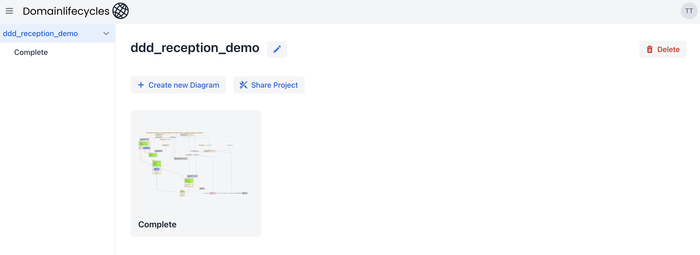
2. Click on ``Add user`` in the following dialog
3. Enter the email adress of the user you want to share the project with.
The user must have registered with the diagram viewer before!
4. If that user now logs in, he can see the project on the left side and all the corresponding diagrams.
He can also edit the diagrams and create new ones, which are automatically shared amon all project users.

## F) Analyzing The Model
For a large project containing a large domain model one diagram with all details my be overwhelming.
There are several options to filter the model and only show the relevant parts in new diagrams.

Every change of a filter or setting is saved right away, while the diagram image is rendered in the background:
a progress bar below the buttons shows that a new image is on its way, and the diagram refreshes once it is ready.
Further changes in the meantime are fine - only the latest one is rendered. If a diagram contains more than
1000 classes (configurable), a hint suggests restricting it with package or flow filters, since very large
diagrams take long to render and are hard to read.

### Filter on package level
We have structured our demo project according to Ports&Adapters, so there is a package 
``com.esentri.rezeption.inbound``.

1. On the right side, add the package in tzhe field ``Excplicitly included packages``, then the diagram will only show the 
model elements from this package and its subpackages.
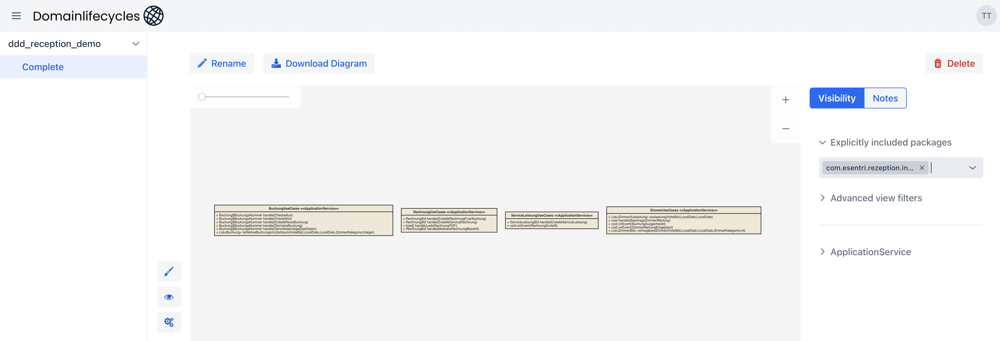

### Filter on Bounded Contexts
If the domain model declares Bounded Contexts (see [Analyze Bounded Contexts](#analyze-bounded-contexts)), the right side
additionally shows the filter ``Bounded Contexts`` above the package filter. Select one or more Bounded Contexts to only
show their model elements. Bounded Contexts are listed by their name, or by their package if they have no name. If both
filters are set, only the model elements lying in both a selected package and a selected Bounded Context are shown.

### General visibility on stereotype level

1. Left to the current diagram, there is a button with a small eye icon. This opens the general visibility settings of the diagram.
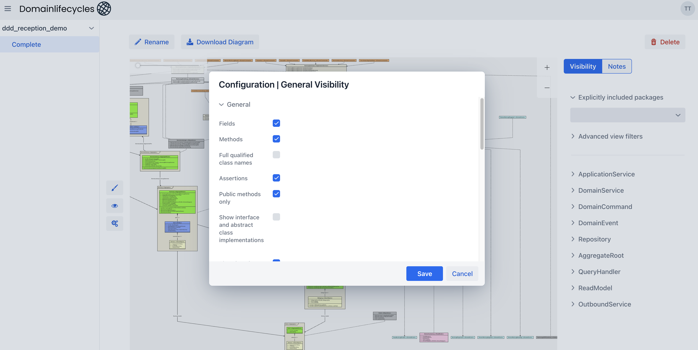
There you define, if fields or methods are shown, if inheritance structures are relevant in the diagram.
Additionally, you can define which stereotypes are shown.
2. For example, you can create a diagram showing only the Aggregates in the domain model, without showing field and method details.
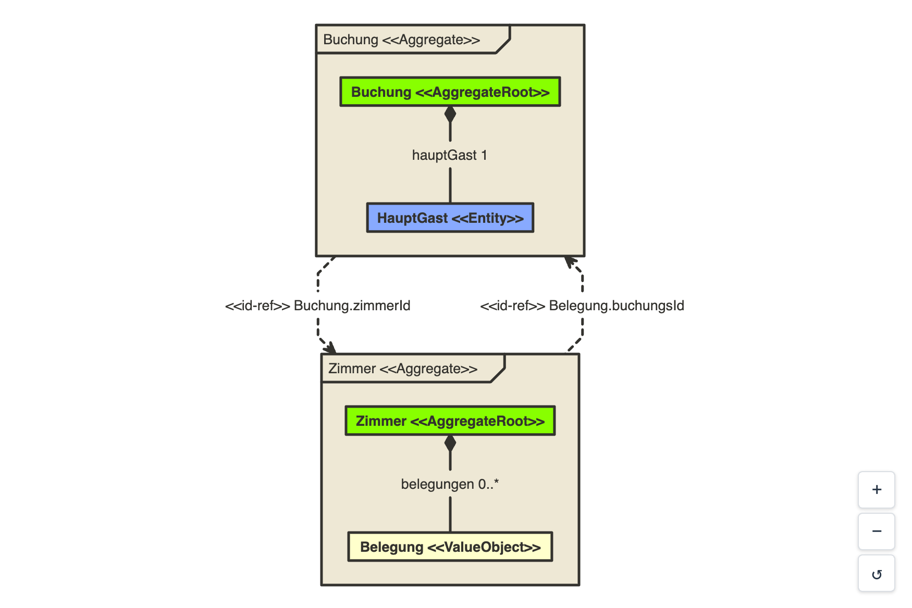
3. In the section ``Aggregates``, ``Inline value objects up to (fields)`` defines up to how many fields a value object
   is shown inline - as field of the class referencing it, e.g. ``price:<VO> Money`` - instead of as class of its own
   connected by a composition. By default value objects of up to 2 fields are shown inline; ``1`` shows only those of a
   single field inline, ``0`` none. A value object containing one that is not shown inline is not shown inline itself.

### Non-domain classes
Besides the classes implementing one of the DLC marker interfaces, the domain model also contains classes
that are not DDD building blocks, e.g. mappers, helpers, REST controllers or message listeners. These
non-domain classes are uploaded with the domain model too (requires a DLC build plugin version supporting non-domain classes) and are shown in the diagram
**by default**, with the stereotype ``<<NonDomain>>``.

A non-domain class is only drawn, if it has a relationship (via a field, a method parameter or a return type) to a service kind
(ApplicationService, DomainService, Repository, QueryHandler, OutboundService or unspecified ServiceKind), in either direction:
- a service depending on a non-domain class, e.g. a mapper an ApplicationService holds a field for
- a non-domain class depending on a service, e.g. a controller calling an ApplicationService

Non-domain classes without such a relationship never appear in a diagram, and are therefore also not offered in the
class selections of the view filters.

To hide non-domain classes, open the general visibility settings (eye icon) and uncheck ``Show`` in the section ``Non-Domain Class``.
There you can also decide whether their fields (hidden by default) and methods (shown by default) are displayed.

### Filter on the domain model element level
Sometimes it is useful to only show specific classes in the diagram and package level filtering is not a sufficient way.
In this case you can hide concrete domain model elements. 

1. On the right side open `Àdvanced view filters` 
2. Select the name of the building blocks to be hidden in ``Invisible objects``.

Alternatively, the building blocks are listed per type on the right side (e.g. ``AggregateRoot``, ``NonDomain``).
Open a type, look up a class with the search field and expand its ``View filter settings`` to hide it or to set
a connection filter for it.

### Filter on connections / relations
Among the advanced filters there are also filters for connections/relations:
There are 4 types of connection based filters:
- ``Include connections to``: Show all elements connected somehow to the specificed element
- ``Include ingoing connections to``: Show all elements having an ingoing connection to the specificed element
- ``Include outgoing connections from``: Show all elements having an outgoing connection from the specificed element
- ``Exclude ingoing connections to``: Hide all elements having an ingoing connection to the specificed element
- ``Exclude outgoing connections from``: Hide all elements having an outgoing connection from the specificed element

For example, to show the model elements, that are connected with the use cases implemented in ``ServiceLeistungenUseCases``,
one might enter the ApplicationService class ``ServiceLeistungUseCases`` in ``Include outgoing connections from`` and see:
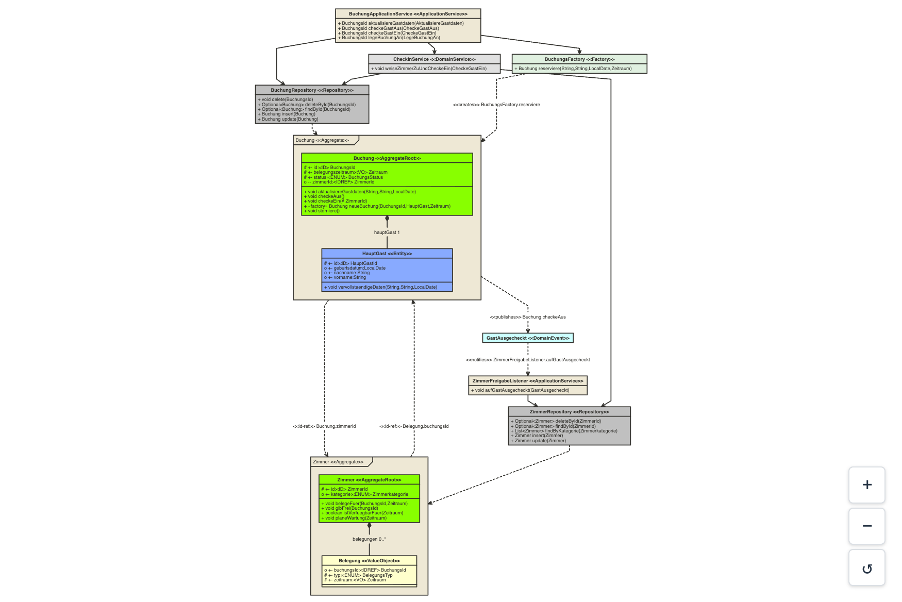

### Filter on flows
The connection filters follow the structural relations of the domain model. A flow filter instead follows the
actual method calls within your domain, joined with the domain events and commands, so a diagram can be restricted
to exactly the parts taking part in a use case.

This requires the result of a static code analysis of your domain classes to be uploaded alongside the domain model.
The DLC build plugins do this by default (``runStaticAnalysis = true``). If no analysis result was uploaded,
flow filtering is disabled for the project: the flow filter is marked as ``unavailable`` and no flows can be added.
Flows configured earlier (e.g. before the domain model was uploaded again with ``runStaticAnalysis = false``) are kept,
but ignored when the diagram is rendered. They are listed read-only as ``Inactive flow filters`` and apply again
as soon as an analysis result is uploaded.

1. On the right side open ``Flow filter``.
2. Choose the ``Direction``:
   - ``Forward (what it leads to)``: the diagram shows everything reached starting from the selected element,
     e.g. all classes involved when a command is processed.
   - ``Backward (what leads into it)``: the diagram shows all entry channels through which the selected element is reached,
     e.g. all callers of a service, or everything leading to the publishing of a domain event.
     For an Aggregate or ReadModel, the Repository or QueryHandler providing it is included as well.
3. Select a ``Class``. For services and other classes with methods you can optionally select a ``Method``
   to restrict the flow to that single method. Leave it empty to include the flows of all methods.
   Domain commands and domain events have no method selection: forward, they start the flow they trigger;
   backward, an event leads to the methods publishing it.
   Domain commands cannot be selected for the backward direction, since nothing in the analyzed code leads *into* a command
   (a command can still appear in a backward flow, if a target is reached because it processes that command).
4. Click ``Add flow``.

The active flows are listed in ``Active flow filters`` (forward) and ``Active backward flow filters`` (backward).
Deselect an entry there to remove that flow again.

Several flows can be combined, also forward and backward ones. The diagram then shows every element reached by any of them.
The flow filter only ever narrows the diagram: package filters, invisible objects and the general visibility settings still apply.
The direction of the drawn relations is not affected by the flow direction, it always follows the domain model.

``Show only the methods called in the flows`` (checked by default) shows, in the classes taking part in a flow, only the
methods called in it - e.g. only ``checkeGastAus`` of the ``BuchungApplicationService`` for the flow from ``CheckeGastAus``.
Classes shown for another reason, e.g. an entity of a shown aggregate or a read model contained in a shown read model,
show their methods as without flow. Uncheck it to see all methods the general visibility settings allow.

``Connect classes calling each other in the flows`` (checked by default) draws a ``<<calls>>`` relationship, labeled with
the called methods, between two classes calling each other in a flow, if no other relationship connects them - e.g. a
class reading a read model it got from elsewhere. Otherwise such classes would stand in the diagram without connection.

For example, with the [Demo Project](https://github.com/esentri/ddd-hotel-demo):
- a forward flow from the command ``CheckeGastAus`` shows the whole guest check-out, including the event ``GastAusgecheckt``
  and its listener ``ZimmerFreigabeListener``
- a backward flow to the event ``GastAusgecheckt`` shows only what leads to it: the command ``CheckeGastAus``,
  the ``BuchungApplicationService`` and the ``Buchung`` aggregate publishing the event

#### Show a flow as text
The diagram shows which elements take part in a flow, not in which order they are called. Click ``Show flow as text``
below the active flows to see the calls step by step. The text is read from top to bottom, in call order:
- ``▲ WHAT LEADS INTO IT`` shows the backward flows. Each is an upside-down tree: its target is at the bottom, and its
  branches open upwards, towards everything leading into it.
- ``▼ WHAT IT LEADS TO`` shows the forward flows as a tree below their start.

```
▲ WHAT LEADS INTO IT
   ┌─ BuchungApplicationService.checkeGastAus(CheckeGastAus)
┌─ Buchung.checkeAus()
[Event] GastAusgecheckt   ◀ target
```

``─`` is a call, ``⇒`` an implementation of the method above it (e.g. of a repository interface), ``↻`` a cycle and
``×3`` three calls of the same method. A step reached on several ways is expanded once, marked with a number like
``[2]``, and referred to everywhere else with ``→ see [2]``. ``⟨vendor⟩`` marks a step in another Bounded Context
than the flow starts in.

Large flows can be narrowed down:
- ``Depth`` limits the number of steps shown from a start or target, ``…`` marks the steps with more behind them.
  Flows of up to 300 lines are shown completely at first, larger ones to a depth of 5.
- ``Hide accessors`` (on by default) summarizes the calls only reading values, e.g. of value objects, identities or
  getters, as ``… 3 accessors hidden``.
- ``Search`` shows only the paths leading to the steps containing the searched text, and highlights these steps.

``Copy`` and ``Download`` take the text as shown, headed by the flows the diagram is restricted to.

## G) Add Notes
There is the option to add notes to the diagram and add information, for discussion or documentation purposes. 

1. When a diagram is selected, on the right side click on ``Notes``.
2. Click ``Add / edit``
3. Select a type (model element) and add a note
4. Click the check mark to save the note
   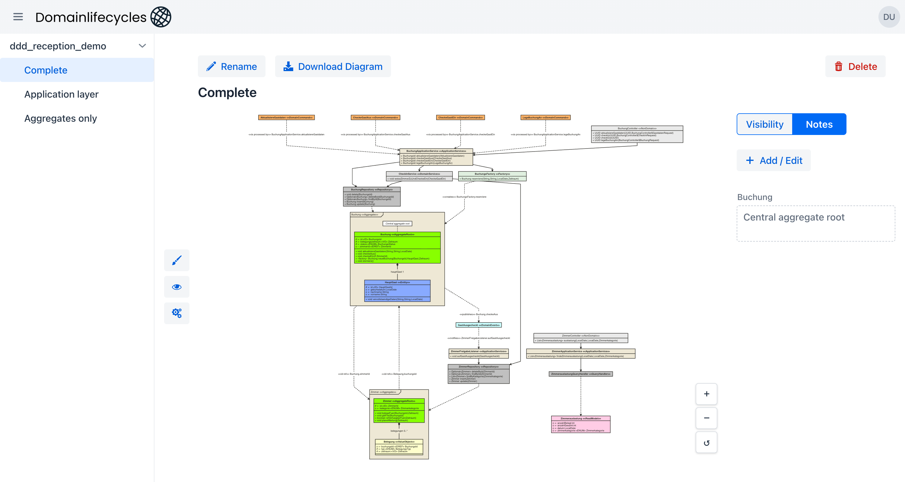

## Use templates to create new diagrams
When creating new diagrams you can use exisitng diagram as templates. All settings and filters will be copied and you can refine the new diagram with less clicks, 
if it's similar to the existing one.

1. Do the same steps as described above to create a new diagram.
2. Before saving the diagram choose ``Template`` in the advanced configuration and select the template you want to use.
   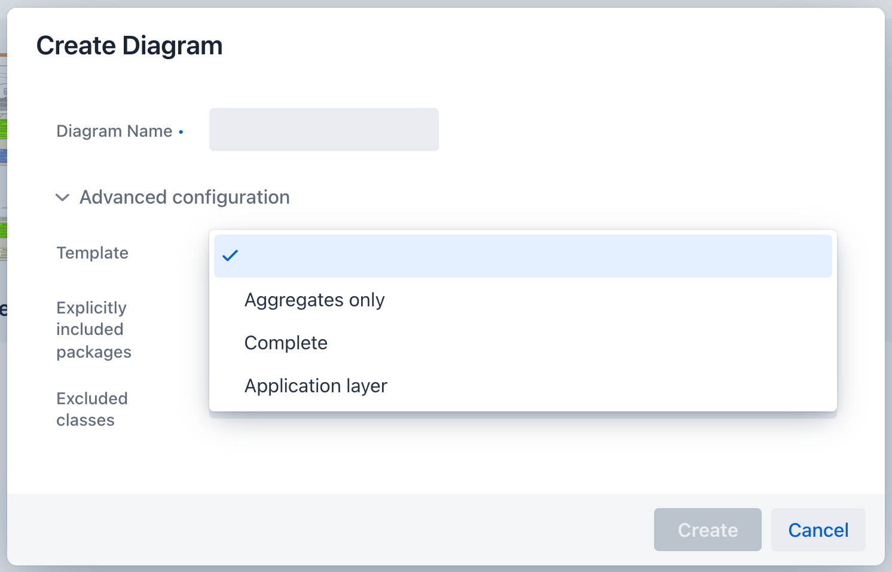


## H) Layout options
Left to the current diagram, there is a button with a small gears icon. 
This opens the general layout and fonts settings of the diagram.

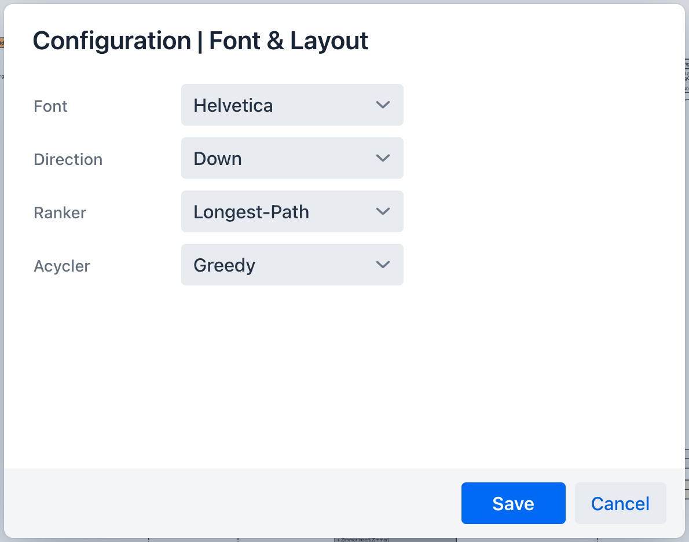

The default layout is a simple top-down layout (``Down``). 
But in some case left to right is better (``Right`)

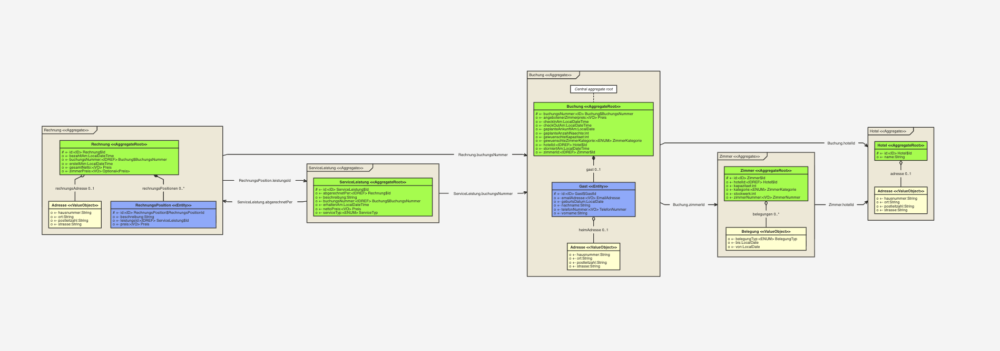

## I) Styling Options
Left to the current diagram, there is a button with a small paintbrush icon.
This opens the general style settings for the node types (supported DDD stereotypes) of the diagram.
Colors and other style settings of each node type can be changed, including non-domain classes (``Non-Domain Class``).

## J) Download diagrams as images

When a diagram is selected, there is a Download button right above. SVG, PBG and JPEG exports are supported.


